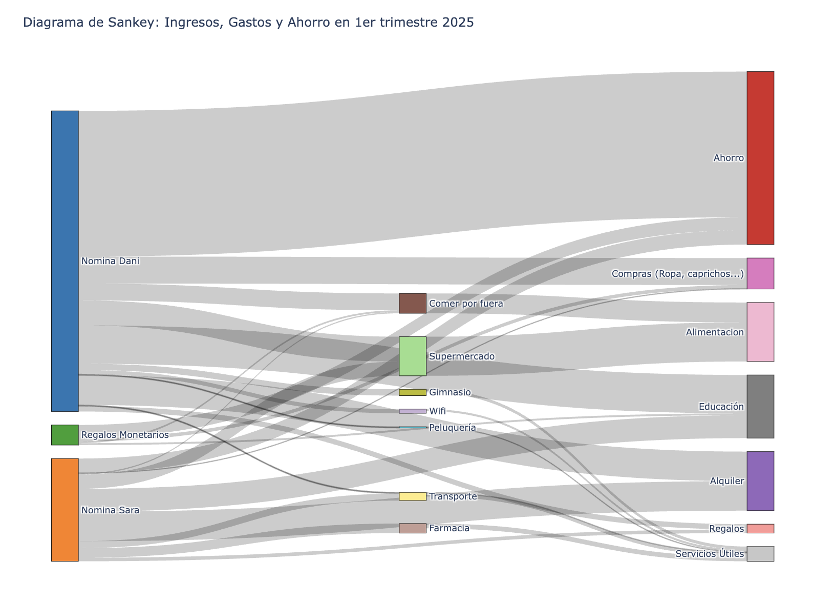
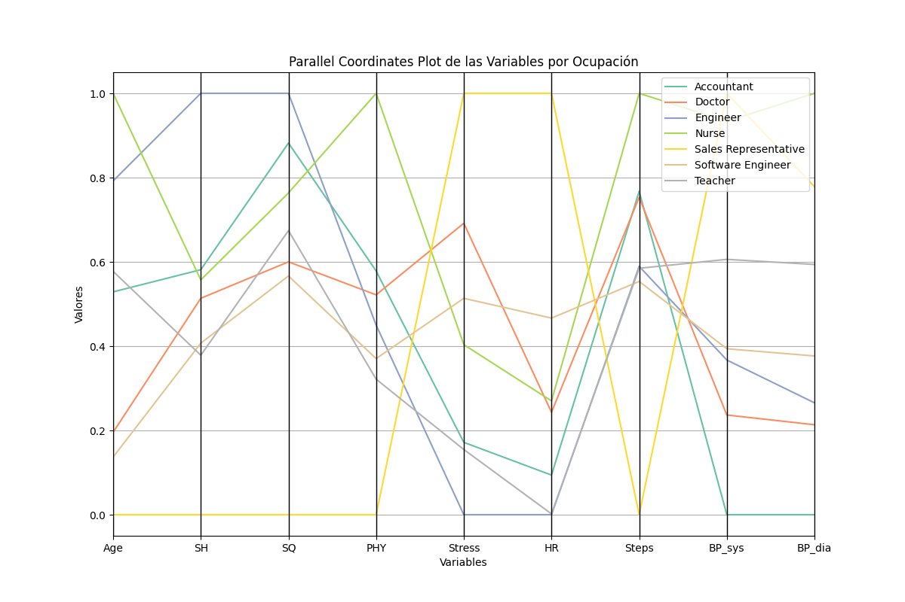
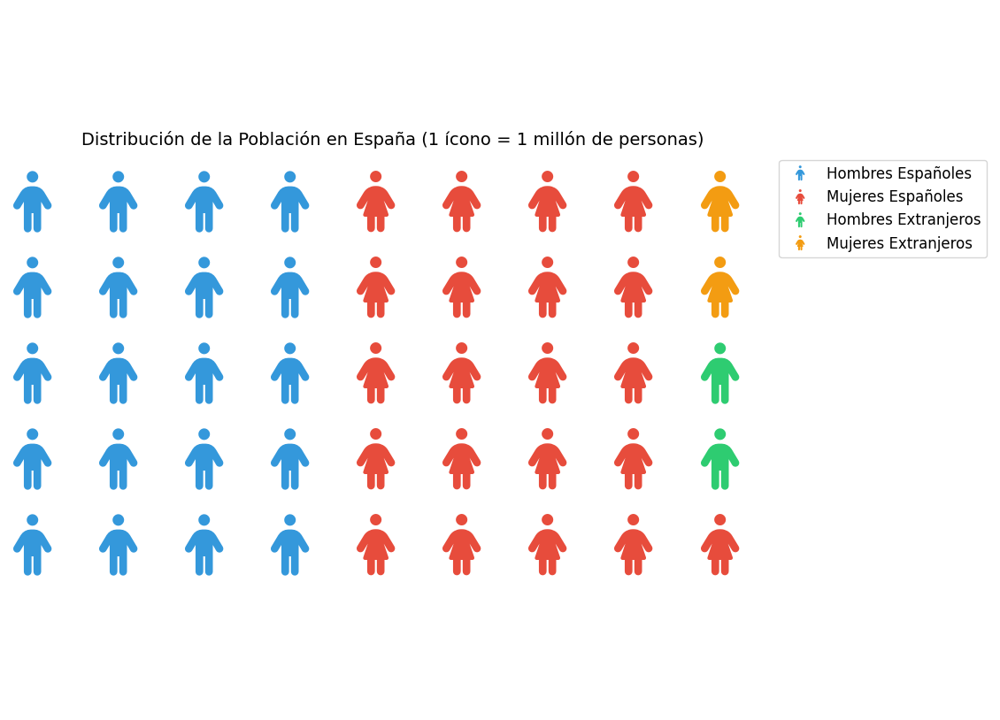

# PEC2 - Saliendo de la zona de confort en la visualización de datos

## Daniel Felipe Gómez Aristizabal

## Indice

- [TÉCNICA GRUPO I (Básicas y populares): Sankey Diagrams](#TÉCNICA-GRUPO-I-Básicas-y-populares-Sankey-Diagrams)
- [TÉCNICA GRUPO II (Habituales y específicas): Parallel Coordinates Plot](#TÉCNICA-GRUPO-II-Habituales-y-específicas-Parallel-Coordinates-Plot)
- [TÉCNICA GRUPO III (Menos habituales o específicas): Isotype & Unit charts](#TÉCNICA-GRUPO-III-Menos-habituales-o-específicas-Isotype-Unit-charts)

## TÉCNICA GRUPO I (Básicas y populares): Sankey Diagrams

Para este ejercicio, he utilizado algunos datos de los ingresos y gastos que he tenido juntos con mi pareja en los últimos 3 meses. Para poder hacer los datos públicos, he modificado los datos para presentar porcetajes en lugar de cantidades.

En el directorio `datasets_pec2_ej1_sankey_diagram` se encuentran los datos utilizados y el resultado de la visualización.

## TÉCNICA GRUPO II (Habituales y específicas): Parallel Coordinates Plot

Para el segundo ejercicio, he utilizado los datos obtenidos de un estudio del sueño, con alrededor de 400 muestras, de la plataforma Kaggle.

[https://www.kaggle.com/datasets/uom190346a/sleep-health-and-lifestyle-dataset](https://www.kaggle.com/datasets/uom190346a/sleep-health-and-lifestyle-dataset)

En el directorio `datasets_pec2_ej2_parallel_coordinates_plot` se encuentran los datos utilizados, después de procesarlos para que sean utilizados en la visualización y el resultado de la visualización.

## TÉCNICA GRUPO III (Menos habituales o específicas): Isotype & Unit charts

Finalmente, para el tercer ejercicio, he utilizado los datos de la población de España, de la página de datos abiertos de España.

[https://datos.gob.es/es/catalogo/ea0010587-poblacion-por-sexo-nacionalidad-espanola-extranjera-y-relacion-entre-lugar-de-residencia-hace-10-anos-y-actual-identificador-api-55208](https://datos.gob.es/es/catalogo/ea0010587-poblacion-por-sexo-nacionalidad-espanola-extranjera-y-relacion-entre-lugar-de-residencia-hace-10-anos-y-actual-identificador-api-55208)

En el directorio `datasets_pec2_ej3_isotype_unit_charts` se encuentran los datos utilizados, después de procesarlos para que sean utilizados en la visualización y el resultado de la visualización.

